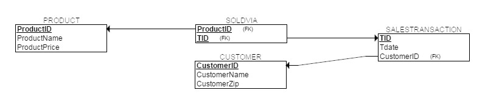

# Bases de données: MariaDB pour SQL, MongoDB pour NoSQL; et Données Massives

**Objectif:** analyser les besoins à partir du modèle conceptuel et déployer la base de données jusqu’à la mise en production.

## SQL ou BD relationnelle

| Déployer une BD relationnelle |    |
|:---|:---|
| Établir le modèle conceptuel avec ERDPlus |  |
| Étudier des études de cas: différents contextes, besoins... |    |
| Maitriser la cardinalité |    |
| Générer le modèle physique avec ERDPlus (tables, champs, clés) |  |
| Installer tous les outils |    |
| Lancer le serveur (myslqd) |    |
| Lancer un ou plusieurs clients (mysql), utiliser les CLI... |    |
| Utiliser Workbench |    |
| Utiliser HeidiSQL |    |
| Créer une BD avec un code source SQL et saisir les données...  |    |
| Réaliser des requêtes (*CRUD* ou *Create Retrieve Update Delete*) |    |
| Réaliser des opérations: opérateurs, *aggregate*, *view*, *join* |    |
| Réaliser d'autres opérations: fonctions, index, *save*, *restore*, etc. |   |

## NoSQL

Découvrir les bases de données NoSQL:

- Document: MongoDB, Elasticsearch, CouchDB, BaseX
- Graph: Neo4j, RediGraph, OrientDB
- Wide Column Stores: Cassandra, CosmoDB, Bigtable, HBase 
- Key:Value: Aerospike, Berkeley DB, Couchbase, DynamoDB, Memcached, Riak, Redis

Faire quelques formation Mongo University:

- M001: MongoDB Basics
- M100: MongoDB for SQL Pros
- M112: Diagnostic Thinking
- A300: Atlas Security

| Déployer MongoDB |    |
|:---|:---|
| Découvrir les schémas et les patrons: différents contextes, besoins... |  |
| Installer tous les outils |  |
| Lancer le serveur (mongod) |  |
| Lancer un ou plusieurs clients (mongo, mongosh), utiliser les CLI... |  |
| Utiliser Compass |  |
| Créer une BD locales et saisir les données... |  |
| Travailler avec Atlas, créer une grappe (*cluster*) et saisir les données... |  |
| Réaliser des requêtes (CRUD ou Create Retrieve Update Delete) |  |
| Réaliser des opérations: opérateurs $, projections, index, agrégation |  |
| Réaliser d'autres opérations: *import*, *save* (CSV, JSON), *dump*, *restore* (BSON) |  |
